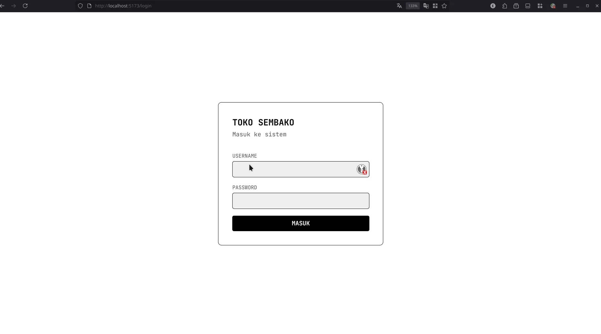
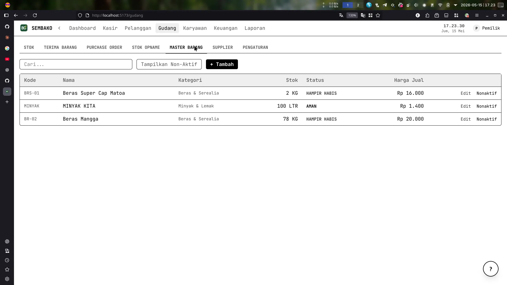
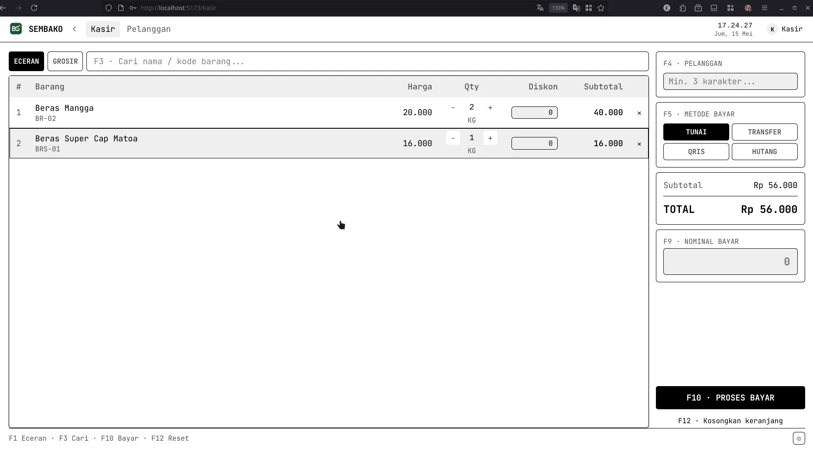
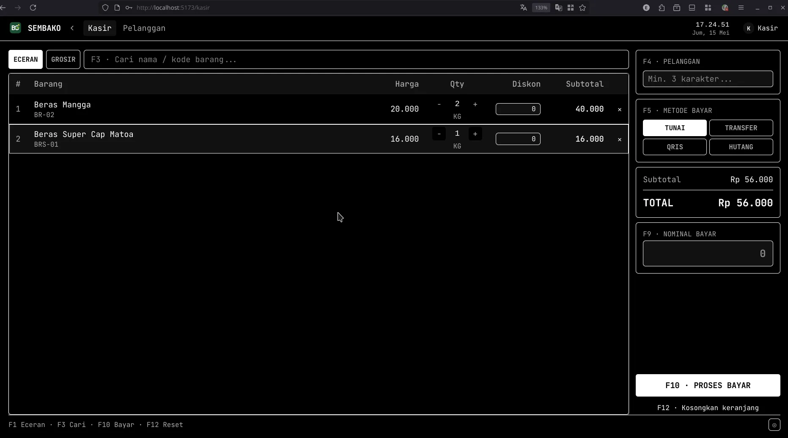
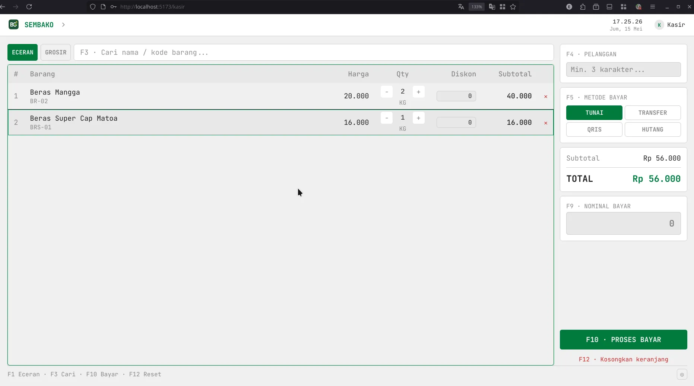
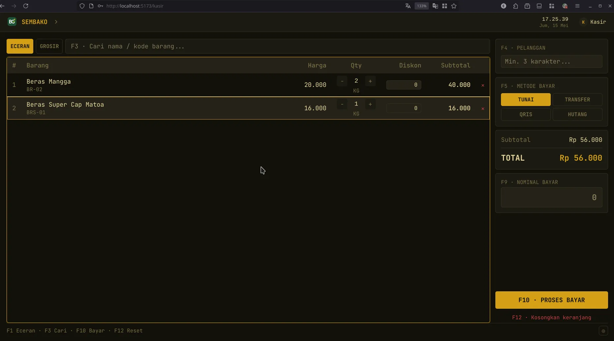
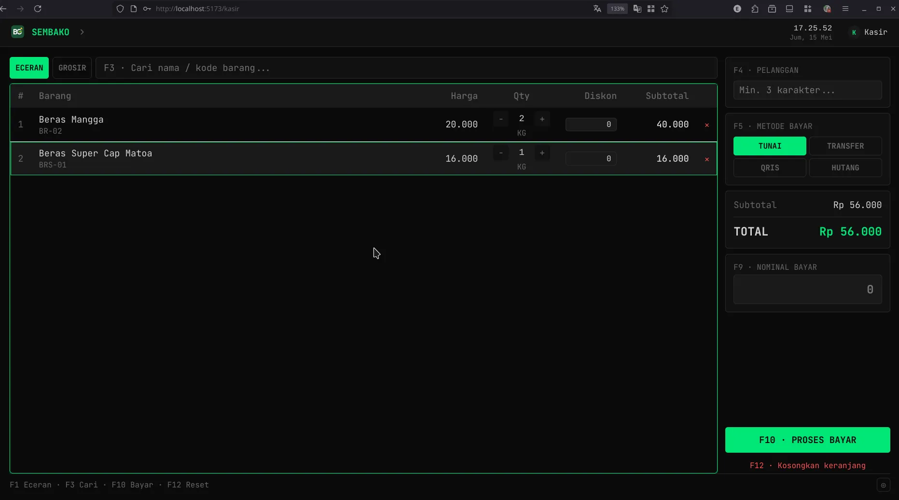

# Sembako App

Aplikasi manajemen toko sembako grosir & eceran — berbasis web, jalan di jaringan WiFi lokal, diakses dari laptop maupun HP.

---

## Fitur Utama

- **Kasir** — transaksi eceran & grosir, shortcut keyboard F1–F12, scan barcode USB/BT/kamera
- **Gudang** — terima barang, kelola stok, purchase order, retur supplier
- **Pelanggan** — kartu member, tier, diskon otomatis, piutang
- **Keuangan** — jurnal kas, hutang supplier, piutang pelanggan, multi akun
- **Laporan** — Laba Rugi, Arus Kas, Neraca, export PDF/Excel
- **Dashboard** — alert stok kritis, anomali kasir, insight otomatis
- **RBAC** — 4 role: `pemilik`, `manajer`, `kasir`, `gudang`

---

## Screenshot
|  |  |  |
|---|---|---|
|  |  |  |
|  |  |  |
|  |  |  |
---

## Tech Stack

| Layer | Teknologi |
|---|---|
| Frontend | SvelteKit · TypeScript · TailwindCSS |
| Backend | Hono.js · Bun runtime |
| Database | SQLite via Drizzle ORM |
| Auth | JWT (httpOnly cookie) |
| Deployment | Raspberry Pi 4 · Nginx · PM2 |

---

## Menjalankan Lokal

```bash
# Terminal 1 — Backend
cd backend
bun install
bun run dev        # → http://localhost:3000

# Terminal 2 — Frontend
cd frontend
bun install
bun run dev        # → http://localhost:5173
```

Migrasi database (pertama kali atau setelah update schema):

```bash
cd backend
bun run db:generate
bun run db:migrate
```

Lihat isi database via GUI:

```bash
bun run db:studio  # → http://local.drizzle.studio
```

Lihat juga: [frontend/README.md](frontend/README.md) untuk detail konfigurasi SvelteKit.

---

## Deploy ke Raspberry Pi

Lihat panduan lengkap di [doc/DEPLOYMENT.md](doc/DEPLOYMENT.md).

Ringkasan:

```bash
# Build & kirim ke Pi sekali perintah
PI_HOST=eg17@192.168.1.x ./deploy.sh
```

Setelah deploy, akses dari semua device di WiFi yang sama:

```
http://[IP_PI]/       ← web app
http://[IP_PI]/api/   ← API backend
```

---

## Struktur Folder

```
sembako-app/
├── frontend/        ← SvelteKit app
├── backend/         ← Hono.js API + SQLite
├── doc/             ← Dokumentasi
│   └── DEPLOYMENT.md
├── deploy.sh        ← Script deploy ke Pi
└── CLAUDE.md        ← Konteks project untuk Claude Code
```

---

## Lisensi

Public domain — lihat [LICENSE](LICENSE).
